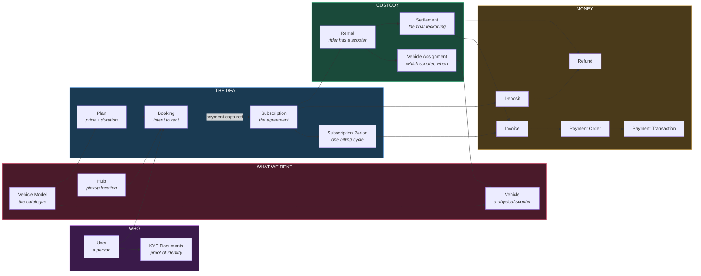
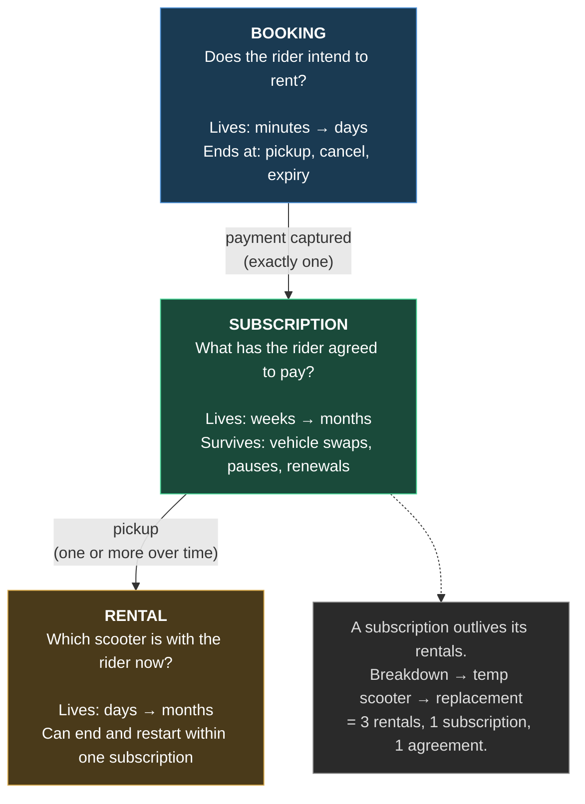
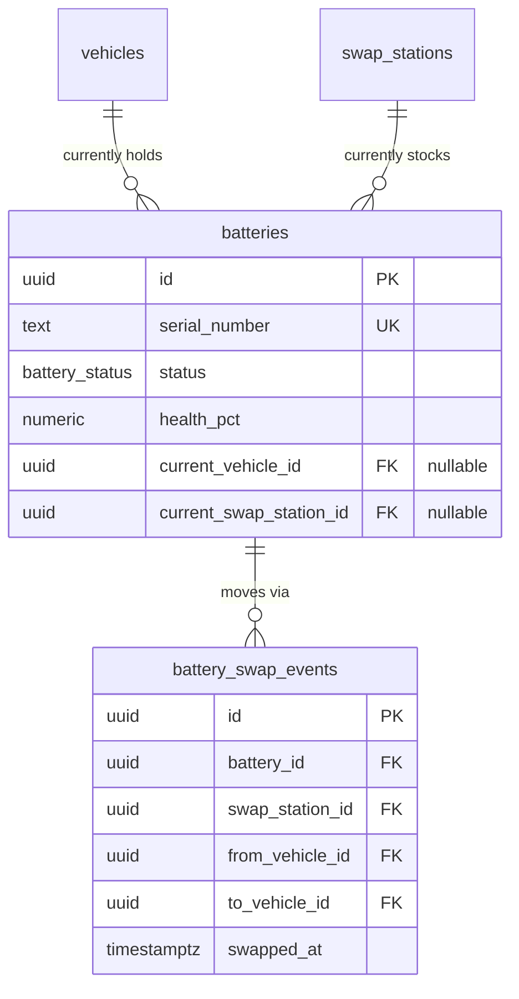
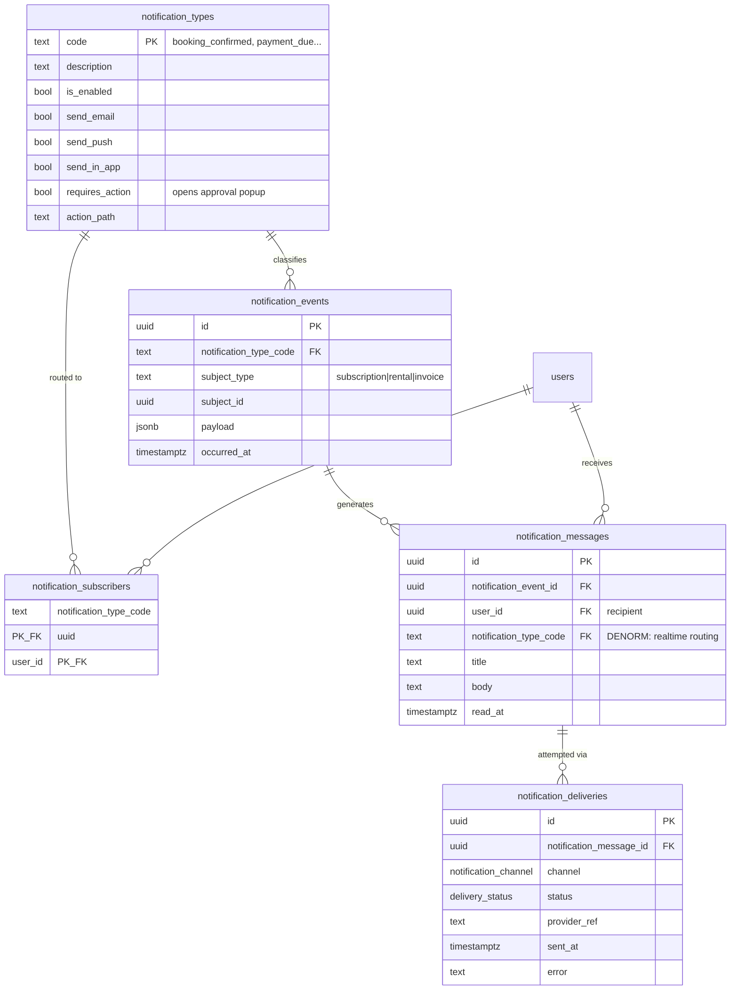
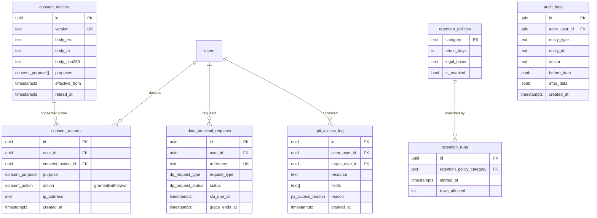
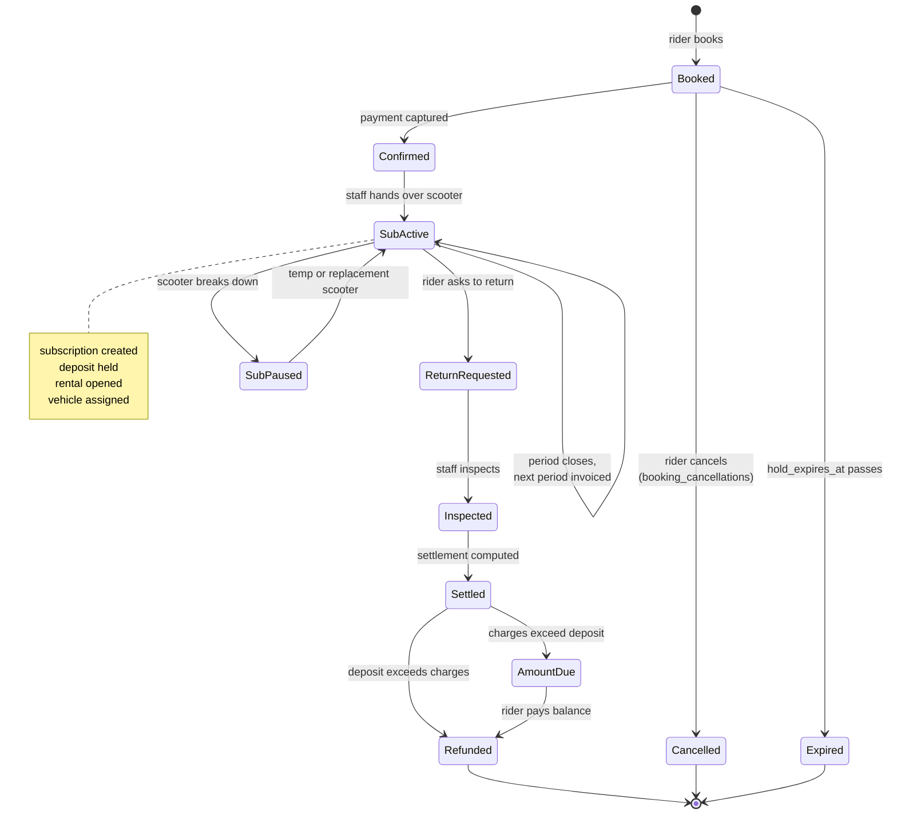

# 12 — Proposed ERD

> **Editable.** Every diagram is Mermaid source — edit the text, the picture follows. Renders in GitHub, VS Code (Markdown Preview Mermaid extension), and any Mermaid live editor.
> **Self-contained.** Nothing here requires knowledge of the old schema.

---

## 1. The shape of the business, in one picture

Read this first. It is the whole design at the level that matters — eight concepts and how they connect.



### The three concepts people conflate



---

## 2. Identity

Who a person is, what they may do, and how they proved it.

```mermaid
erDiagram
    users ||--o| rider_profiles : "is a rider"
    users ||--o| staff_profiles : "is staff"
    users ||--o{ user_addresses : "lives at"
    users ||--o{ user_related_persons : "nominates"
    users ||--o{ user_devices : "signs in from"
    users ||--o{ kyc_documents : "proves identity with"
    modules ||--o{ permissions : "scopes"
    permissions ||--o{ role_permissions : "granted by"
    permissions ||--o{ user_permission_overrides : "overridden by"
    permissions ||--o{ permission_profile_permissions : "bundled in"
    permission_profiles ||--o{ permission_profile_permissions : "bundles"
    users ||--o{ user_permission_overrides : "has"

    users {
        uuid id PK "= auth.users.id"
        text full_name
        text phone UK
        text email UK
        date date_of_birth
        user_role role "rider | staff | admin"
        user_status status
        timestamptz deleted_at
        timestamptz erased_at
    }
    rider_profiles {
        uuid user_id PK_FK
        kyc_status kyc_status "DERIVED"
        timestamptz onboarding_completed_at
    }
    staff_profiles {
        uuid user_id PK_FK
        text staff_code UK
        bool must_change_password
    }
    user_addresses {
        uuid id PK
        uuid user_id FK
        address_type address_type
        bool is_primary
    }
    user_related_persons {
        uuid id PK
        uuid user_id FK
        related_person_role person_role "nominee | emergency"
    }
    user_devices {
        uuid id PK
        uuid user_id FK
        text push_token UK
        timestamptz last_seen_at
    }
    kyc_documents {
        uuid id PK
        uuid user_id FK
        kyc_document_type document_type
        text document_number_last4
        bytea document_number_encrypted
        verification_status verification_status
        date expires_on
    }
    modules {
        text key PK "bookings, kyc, refunds..."
        text label
        smallint sort_order
    }
    permissions {
        uuid id PK
        text module_key FK UK
        text action UK "view, edit, approve..."
        bool is_enforced "false = no route yet"
    }
    role_permissions {
        user_role role PK "staff (admin bypasses)"
        uuid permission_id PK_FK
    }
    user_permission_overrides {
        uuid user_id PK_FK
        uuid permission_id PK_FK
        bool is_granted "true=grant false=revoke"
    }
    permission_profiles {
        text code PK "viewer, finance_staff..."
        text label
        bool is_system
    }
    permission_profile_permissions {
        text permission_profile_code PK_FK
        uuid permission_id PK_FK
    }
```

**`modules` + `permissions` + `permission_profiles` are the admin console's vocabulary, held as data.** In the old system these lived as four TypeScript constants duplicated between the backend and the web app, each with a comment warning they must be hand-synced. A profile is a *template*: applying one writes `user_permission_overrides` rows and the link is not kept.

**Why `rider_profiles` and `staff_profiles` are separate from `users`:** a rider row carries no staff columns and vice versa. In the old schema every rider carried `staff_code` and `must_change_password` as nulls.

**Why one permission system:** the old schema had three (roles, per-module permissions, capabilities) plus a config file duplicated across two apps. Here a role grants permissions, a user may be granted or revoked one individually, and `v_user_effective_permissions` resolves it.

**Why `users.role` is a column, not a table.** Three roles, no overlap: `rider` uses the mobile app, `staff` and `admin` use the web console, `admin` bypasses every permission check. The old `roles` table held 5 labels and 1 live row, and `user_roles` expressed a many-to-many nothing used — `technician` and `station_manager` counted as staff server-side but no code ever distinguished them. One column also makes RLS cheaper: `is_staff()` is a comparison against a single JWT claim rather than a membership test, on a predicate that runs per row.
*Consequence:* one person = one role. An employee who also rents needs a second account.

---

## 3. Fleet

The physical assets and where they live.

```mermaid
erDiagram
    vendors ||--o{ vehicle_models : "manufactures"
    vehicle_models ||--o{ vehicle_model_media : "shown by"
    vehicle_models ||--o{ vehicles : "realised as"
    vehicle_models ||--o{ plans : "rented under"
    hubs ||--o{ vehicles : "parked at"
    vehicles ||--o{ vehicle_documents : "registered by"
    vehicles ||--o| vehicle_disposals : "retired by"
    vehicles ||--o{ maintenance_tickets : "serviced by"
    swap_stations ||--o{ swap_station_qis_ids : "identified by"

    vendors {
        uuid id PK
        text name UK
    }
    vehicle_models {
        uuid id PK
        uuid vendor_id FK
        text name
        vehicle_category category
        numeric battery_range_km "typed - riders filter"
        numeric top_speed_kmph "typed"
        jsonb features "marketing only"
        bool is_active
    }
    vehicle_model_media {
        uuid id PK
        uuid vehicle_model_id FK
        text storage_path
        smallint sort_order
        bool is_primary
    }
    vehicles {
        uuid id PK
        uuid vehicle_model_id FK "no free-text model"
        uuid hub_id FK
        text registration_number UK
        text vin UK
        vehicle_status status
        date purchased_on
    }
    vehicle_documents {
        uuid id PK
        uuid vehicle_id FK
        vehicle_document_type document_type "registration|insurance|puc|fitness"
        date issued_on
        date expires_on
    }
    vehicle_disposals {
        uuid vehicle_id PK_FK
        date disposed_on
        text reason
        uuid approved_by_user_id FK
        numeric salvage_amount
    }
    maintenance_tickets {
        uuid id PK
        uuid vehicle_id FK
        maintenance_type maintenance_type "corrective|preventive"
        maintenance_status status
        maintenance_outcome outcome
        timestamptz expected_ready_at
    }
    hubs {
        uuid id PK
        text code UK
        geography location "Point 4326"
        bool is_active
    }
    swap_stations {
        uuid id PK
        text code UK
        geography location "Point 4326"
        swap_station_status status
        int battery_count
        bool is_rider_visible
    }
    swap_station_qis_ids {
        uuid swap_station_id PK_FK
        text qis_id PK "globally unique"
    }
```

**`vehicles` has no battery, no insurance and no manufacturer columns.** Insurance is a `vehicle_documents` row. Manufacturer comes through `vehicle_models → vendors`. The battery is Phase 2 (below).

**`hubs` vs `swap_stations`** are two different real things — where you collect a scooter, and where you swap a battery. Both use the same spatial type.

### Phase 2 — batteries *(designed, not required)*



A battery is in exactly one place — a scooter or a station — enforced by a check constraint. `swap_stations.battery_count` becomes derived when this ships.

---

## 4. Commercial — booking, subscription, rental

The core of the business. Note the strict left-to-right flow: nothing points backwards.

```mermaid
erDiagram
    plans ||--o{ bookings : "chosen in"
    users ||--o{ bookings : "makes"
    hubs ||--o{ bookings : "collected from"
    bookings ||--o| booking_cancellations : "cancelled by"
    bookings ||--o| subscriptions : "becomes"
    plans ||--o{ subscriptions : "priced by"
    subscriptions ||--o{ subscription_periods : "bills in"
    subscriptions ||--o{ subscription_pauses : "paused by"
    subscriptions ||--o| deposits : "secured by"
    subscriptions ||--o{ rentals : "fulfilled by"
    rentals ||--o{ rental_vehicle_assignments : "uses"
    vehicles ||--o{ rental_vehicle_assignments : "assigned in"
    rentals ||--o| rental_returns : "ended by"
    rentals ||--o| rental_settlements : "settled by"
    rentals ||--o| rental_feedback : "rated by"

    plans {
        uuid id PK
        uuid vehicle_model_id FK
        text name UK
        billing_period billing_period "daily|weekly|monthly"
        numeric price_amount
        int duration_days
        numeric deposit_amount
        bool is_active
    }
    bookings {
        uuid id PK
        uuid user_id FK
        uuid plan_id FK
        uuid hub_id FK
        date requested_start_on
        booking_status status
        uuid held_vehicle_id FK
        timestamptz hold_expires_at
        numeric plan_price_snapshot "IMMUTABLE"
        numeric deposit_amount_snapshot "IMMUTABLE"
        int duration_days_snapshot "IMMUTABLE"
    }
    booking_cancellations {
        uuid booking_id PK_FK
        timestamptz cancelled_at
        uuid cancelled_by_user_id FK
        text reason
        numeric penalty_amount
    }
    subscriptions {
        uuid id PK
        uuid user_id FK
        uuid booking_id FK UK
        uuid plan_id FK
        subscription_status status
        date started_on
        numeric plan_price_snapshot "IMMUTABLE"
        numeric deposit_amount_snapshot "IMMUTABLE"
    }
    subscription_periods {
        uuid id PK
        uuid subscription_id FK
        int sequence_number
        date starts_on
        date ends_on
        date due_on
        period_status status "scheduled|current|closed"
    }
    subscription_pauses {
        uuid id PK
        uuid subscription_id FK
        uuid maintenance_ticket_id FK
        timestamptz paused_at
        timestamptz resumed_at
        int days_paused
        pause_reason reason
    }
    rentals {
        uuid id PK
        uuid subscription_id FK
        uuid user_id FK "for RLS"
        rental_status status
        timestamptz picked_up_at
        timestamptz returned_at
        timestamptz due_back_at
    }
    rental_vehicle_assignments {
        uuid id PK
        uuid rental_id FK
        uuid vehicle_id FK
        assignment_reason reason "initial|temp_swap|replacement"
        timestamptz assigned_at
        timestamptz released_at "null = current"
    }
    rental_returns {
        uuid rental_id PK_FK
        timestamptz requested_at
        timestamptz inspected_at
        uuid inspected_by_user_id FK
        timestamptz approved_at
        return_status status
    }
    rental_settlements {
        uuid rental_id PK_FK
        numeric deposit_amount_snapshot
        numeric total_charges_amount
        numeric net_amount "ENFORCED"
        settlement_outcome outcome
        uuid refund_id FK
        uuid invoice_id FK
    }
    rental_feedback {
        uuid rental_id PK_FK
        smallint rating
        text comment
    }
```

**`rentals` has no `vehicle_id`.** The current scooter is the `rental_vehicle_assignments` row where `released_at IS NULL`. A breakdown swap closes one assignment and opens another — so history is free and the value can never go stale. This directly fixes the old schema's second-highest-risk defect.

**Renewal is not four columns.** A scheduled renewal is a `subscription_periods` row with `status = 'scheduled'` and a future `starts_on`.

**A pause is not two columns.** It is a `subscription_pauses` row. Total days paused is `SUM(days_paused)`, never stored.

---

## 5. Billing

Money in, money out. Every arrow is one-way.

```mermaid
erDiagram
    subscriptions ||--o{ invoices : "billed by"
    subscription_periods ||--o| invoices : "for period"
    invoice_series ||--o{ invoices : "numbers"
    users ||--o{ invoices : "owes"
    invoices ||--o{ invoice_items : "itemised as"
    pricing_rules ||--o{ subscription_adjustments : "applied as"
    subscriptions ||--o{ subscription_adjustments : "charged"
    subscription_adjustments ||--o| invoice_items : "billed as"
    invoices ||--o{ payment_orders : "paid via"
    payment_orders ||--o{ payment_transactions : "captured as"
    payment_transactions ||--o{ payment_allocations : "allocated to"
    invoices ||--o{ payment_allocations : "settled by"
    payment_transactions ||--o{ refunds : "reversed by"
    subscriptions ||--o| deposits : "holds"

    invoices {
        uuid id PK
        uuid user_id FK
        uuid subscription_id FK "always present"
        uuid subscription_period_id FK "nullable"
        uuid rental_id FK "nullable"
        text invoice_number UK
        invoice_purpose purpose
        invoice_status status "draft|issued|void"
        date issued_on
        date due_on
        numeric subtotal_amount
        numeric total_amount "ENFORCED"
        char currency "INR"
    }
    invoice_items {
        uuid id PK
        uuid invoice_id FK
        smallint line_number
        invoice_item_type item_type
        uuid subscription_adjustment_id FK "nullable"
        text description
        numeric amount "signed: - = credit"
    }
    pricing_rules {
        uuid id PK
        text code UK
        pricing_rule_kind kind "charge|discount"
        amount_type amount_type "fixed|percentage"
        numeric amount
        rule_frequency frequency
        int frequency_n
        rule_scope scope
        uuid scope_ref_id
        date effective_from
        date effective_to
        bool is_active
    }
    subscription_adjustments {
        uuid id PK
        uuid subscription_id FK
        uuid subscription_period_id FK
        uuid pricing_rule_id FK
        pricing_rule_kind kind
        numeric amount "signed"
        adjustment_status status
    }
    payment_orders {
        uuid id PK
        uuid invoice_id FK
        uuid user_id FK
        text gateway_order_id UK
        text idempotency_key UK
        numeric amount
        payment_order_status status
        timestamptz expires_at
    }
    payment_transactions {
        uuid id PK
        uuid payment_order_id FK
        text gateway_payment_id UK "IDEMPOTENCY ANCHOR"
        payment_status status
        numeric amount
        payment_method method
        timestamptz captured_at
    }
    payment_allocations {
        uuid id PK
        uuid payment_transaction_id FK
        uuid invoice_id FK
        numeric amount
    }
    refunds {
        uuid id PK
        uuid user_id FK
        uuid payment_transaction_id FK "what is reversed"
        refund_reason reason
        numeric amount
        refund_status status
        text gateway_refund_id UK
        int attempt_count
    }
    deposits {
        uuid id PK
        uuid subscription_id FK UK
        numeric amount
        deposit_status status "pending|held|released|forfeited"
        date refund_eligible_on
    }
    invoice_series {
        text code PK
        text financial_year
        int last_number "gap-free"
    }
    payment_webhook_events {
        uuid id PK
        text gateway_event_id UK
        bool is_signature_valid
        jsonb payload
        timestamptz processed_at
    }
```

**`invoices` has no `payment_status`.** Whether an invoice is paid is `SUM(payment_allocations.amount) >= total_amount`, exposed by `v_invoice_balances`. One lifecycle per table.

**`invoices` has one nullable parent, not seven.** Anything else billable is a line item.

**Charges and discounts are one thing.** A `pricing_rules` row has a `kind`; an applied adjustment carries a **signed** amount. Discounts are negative. This removes two tables and four enums.

**`refunds` always reverses a real payment.** `payment_transaction_id` is required, so there is no polymorphic parent and no forced deposit link.

---

## 6. Operations and support

```mermaid
erDiagram
    vehicles ||--o{ incidents : "involved in"
    rentals ||--o{ incidents : "occurred during"
    incidents ||--o{ damages : "costs"
    damages ||--o| damage_disputes : "contested by"
    damages ||--o| subscription_adjustments : "billed as"
    users ||--o{ support_tickets : "raises"
    support_tickets ||--o{ support_ticket_messages : "discussed in"

    incidents {
        uuid id PK
        uuid vehicle_id FK
        uuid rental_id FK "nullable"
        incident_type incident_type "damage|accident|theft|vandalism"
        timestamptz occurred_at
        text description
        text[] photo_paths
        incident_status status
    }
    damages {
        uuid id PK
        uuid incident_id FK
        numeric assessed_amount
        uuid assessed_by_user_id FK
        damage_status status
    }
    damage_disputes {
        uuid damage_id PK_FK
        timestamptz raised_at
        uuid raised_by_user_id FK
        text reason
        numeric amount_held
        timestamptz resolved_at
        dispute_outcome outcome
    }
    support_tickets {
        uuid id PK
        uuid user_id FK
        uuid rental_id FK
        support_category category
        support_priority priority
        support_status status
        uuid assigned_to_user_id FK
    }
    support_ticket_messages {
        uuid id PK
        uuid support_ticket_id FK
        uuid author_user_id FK
        text body
        bool is_internal_note
    }
```

**Incident and damage are separated.** An *incident* is what happened — including theft and accidents, which have no repair cost. A *damage* is the money arising from an incident. The old schema had two overlapping tables and could not express a theft.

---

## 7. Notifications

Three lifecycles that the old schema packed into one 17-column table.



**Why three tables:** one event fans out to several recipients; one message may be delivered on two channels; retention destroys delivery bodies while preserving the event. The old schema's single table forced one row per (event × recipient × channel) and made retention destroy the rider's inbox.

**Only `notification_messages` is published to realtime.** The admin console's bell and approval popups subscribe to it; events are an internal stream and deliveries are provider diagnostics, so neither is exposed to a browser. `notification_type_code` is duplicated onto the message on purpose — realtime payloads arrive unjoined, and the console routes on the type. See [17](17-rls-strategy.md) §9 and [18](18-admin-console-integration.md).

---

## 8. Compliance

Carried forward from the old schema, which got this right. All append-only.



**`audit_logs` and `pii_access_log` deliberately use untyped `entity_type`/`entity_id` pointers** — an audit record must survive the deletion of what it references, so a real FK would be wrong here. This is the one place a polymorphic pointer is correct.

---

## 9. Lifecycle — one rider, end to end



---

## 10. Editing these diagrams

- **In VS Code** — install *Markdown Preview Mermaid Support*, then `Ctrl+Shift+V`.
- **In the browser** — paste any block into <https://mermaid.live>.
- **In GitHub** — renders natively in the file view.

Mermaid ER notation used here:

| Symbol | Meaning |
|---|---|
| `\|\|--o{` | one-to-many, child optional |
| `\|\|--o\|` | one-to-one, child optional |
| `\|\|--\|{` | one-to-many, at least one child required |
| `PK` / `FK` / `UK` | primary key / foreign key / unique key |
| `PK_FK` | the foreign key **is** the primary key (1:1, or a join table) |

Column lists in these diagrams are **abridged to the columns that carry meaning**. [13-table-by-table-design.md](13-table-by-table-design.md) is authoritative for the complete definition of every table.
